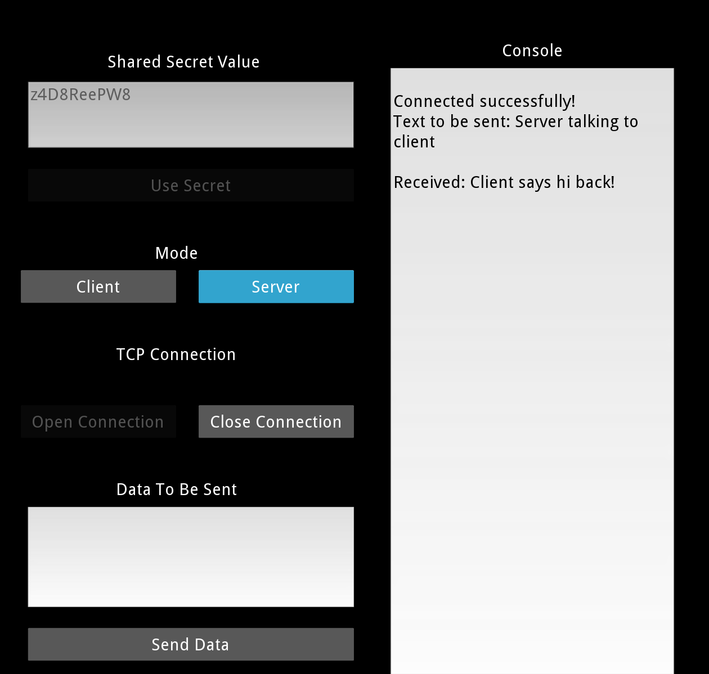

Requirement

- Python 2.7
- kivy 1.9.0
- pycrypto

Usage

To run the program
>> python main.py

Running

Run one instance of program, program is default to server mode
click Open Connection button and type in a port number

Run another instance of the program, click client button to toggle to client mode
click Open Connection button and type in appropriate host and port to connect to server

Enter shared secret value into client and click Use Secret button
Enter shared secret value into server and click Use Secret button

The server and client should be mutually authenticated now and the send data button changes from diasbled to enabled

Type in message to send between client and server, the message exchanged is displayed in console

Client close connection and quit program
Server close connection and quit program
